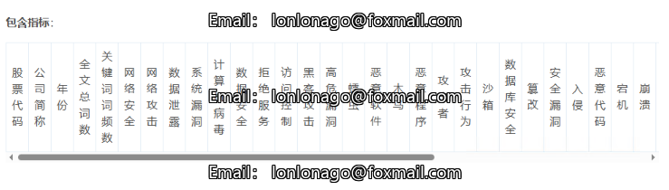
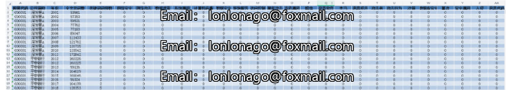

# Corporate Network Security Risk Index Data Set.xlsx

Data Source: This dataset is collected from the annual reports of listed companies published on the Shenzhen and Shanghai Stock Exchange websites by Professor Geng Yong and colleagues (2024). Through 
meticulous reading of these annual reports, a 39-keyword dictionary for enterprise network security risks was established, including topics such as "network security" and "cyber attack." Subsequently,
 keyword search, matching, and frequency statistics were conducted on the texts in the management analysis and discussions sections of the annual reports. The frequency of occurrence of each risk 
keyword was compiled and summarized.

Timespan: 2001-2023
Data Range: Listed Companies
References:
[1] Wang Hui, He Dongxin, Chen Xu, et al. Cybersecurity Governance and Stock Price Crashes Risk - Evidence from Annual Report Text Analysis [J/OL]. Financial Review, 2024, (01): 86-106 [August 15, 
2024].
[2] Geng Yong, Xiang Xiaojian, Wan Panbing. Trust Diminishing in Supply Chains: Cybersecurity Risks and Trade Credit of Enterprises [J/OL]. China Industrial Economy, 2024, (05): 135-154 [August 21, 
2024].

## Images

Here is a pay link on Stripe ( https://buy.stripe.com/3cs8yP7sY87d0vu9AB ). Please contact me lonlonago@foxmail.com after funding $89, and I will send you a complete data files , thank you!

